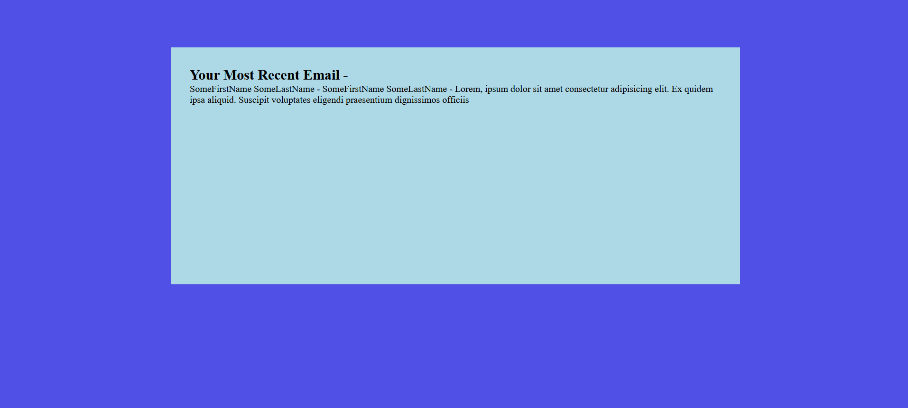
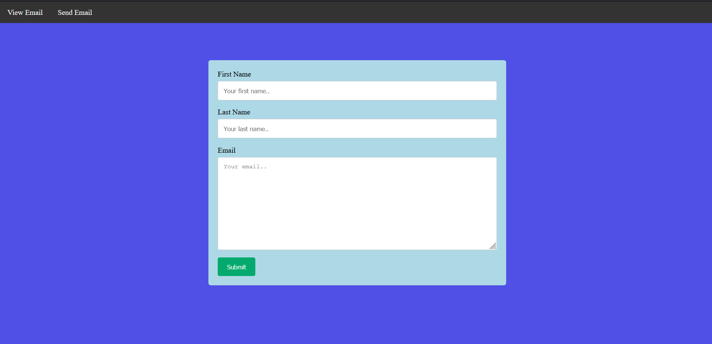

## Gmail API Implementation In Node.js 
## View Email Page

## Send Email Page

### Built With

* node.js
* express.js
* ejs
* gmail api
* HTML5
* CSS3

## Functionality

* Contains a form to send emails.
* Displays most recent email.
* Contains navigation bar.
