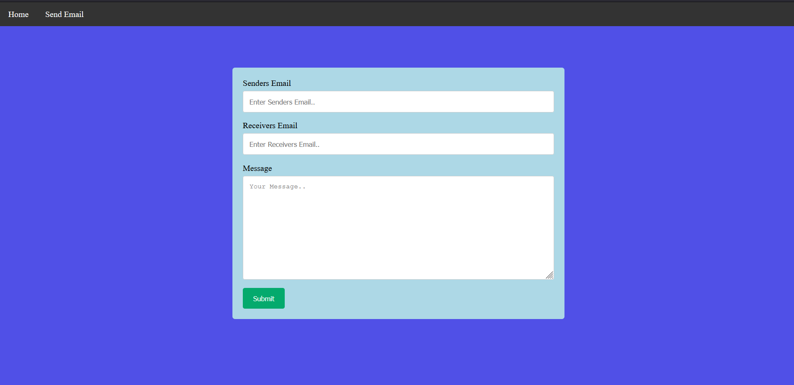

## Gmail API Implementation Using Google SignIn Library In Node.js 
## SignIn With Google Page

## Send Email Page

### Built With

* node.js
* express.js
* gmail api
* HTML5
* CSS3

## Functionality

* Contains google signin library.
* Contains a form to send emails.
* Contains navigation bar.
